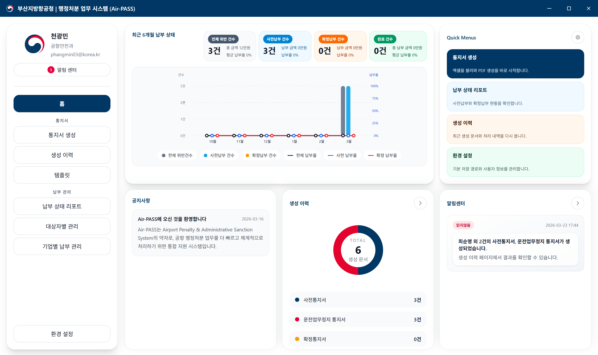
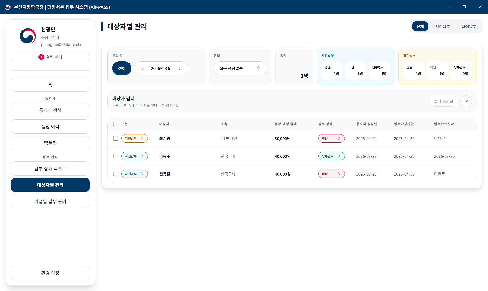
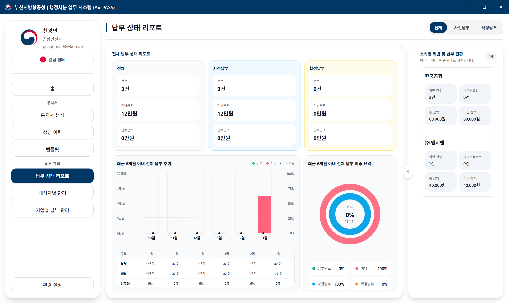

<div align="center">


# ✈️ Air-PASS

### Airport Penalty & Administrative Sanction System

**부산지방항공청 행정처분 과태료 업무 통합 지원 시스템**

<br/>


</div>

---

## 📌 개요

**Air-PASS**는 **Airport Penalty & Administrative Sanction System**의 약자로,
공항 행정처분 업무를 더 빠르고 체계적으로 처리하기 위한 **통합 지원 데스크탑 애플리케이션**입니다.

부산지방항공청 공항안전과 담당자가 위반 행위자에 대한 행정처분 통지서를 발급하고, 납부 현황을 추적·관리하는 모든 업무를 하나의 프로그램에서 처리할 수 있도록 설계되었습니다.

> **기존 방식의 문제점**: Excel 수작업으로 통지서 초안을 작성하고, 개인별 납부 현황을 별도로 관리해야 해서 누락·오류 위험이 높고 업무 효율이 낮았습니다.
>
> **Air-PASS의 해결책**: Excel 데이터를 불러와 통지서 PDF를 자동 생성하고, 내장 DB(SQLite)로 납부 현황을 체계적으로 관리합니다.

---

## 🖥️ 스크린샷

### 홈 대시보드
> 최근 6개월 납부 현황 차트, 생성 이력 요약, 알림센터, 빠른 메뉴를 한눈에 확인합니다.



### 대상자별 관리
> 위반 대상자별 납부 유형(사전납부/확정납부), 납부 상태(미납/납부완료), 금액, 기한을 조회·관리합니다.



### 납부 상태 리포트
> 전체·사전납부·확정납부 통계, 최근 6개월 납부 추이 차트, 소속별 위반 및 납부 현황을 시각화합니다.



---

## ✨ 주요 기능

### 📄 통지서 자동 생성
- **Excel → PDF** 자동 변환 (xlsx 파일 불러오기)
- 지원 통지서 유형: **사전통지서**, **운전업무정지 통지서**, **확정통지서**
- Handlebars 템플릿 엔진 기반으로 통지서 레이아웃 커스터마이징 가능

### 📋 생성 이력 관리
- 생성된 모든 통지서의 이력 조회
- 문서 유형별 필터링 및 재열람
- 생성 일시, 대상자, 문서 종류 등 메타데이터 기록

### 👤 대상자별 납부 관리
- 월별 대상자 목록 조회 (사전납부 / 확정납부 구분)
- 납부 상태 실시간 업데이트 (미납 / 납부완료)
- 이름·소속·상태 등 다양한 조건으로 필터링
- 납부 예정금액, 납부마감기한, 납부완료일 관리

### 🏢 기업별 납부 관리
- 소속 기업 단위로 위반 건수 및 납부 현황 집계
- 미납 잔액이 큰 순서로 정렬하여 우선순위 파악

### 📊 납부 상태 리포트
- 전체 / 사전납부 / 확정납부 통계 카드
- 최근 6개월 납부 추이 막대 차트
- 납부 비중 도넛 차트 (납부완료 vs 미납)
- 소속별 위반 및 납부 현황 패널

### 🔔 알림센터
- 통지서 생성 완료, 납부 마감 임박 등 주요 이벤트 알림
- 읽음/읽지않음 상태 관리

### ⚙️ 환경 설정
- 기본 저장 경로 설정
- 사용자 정보(이름, 소속, 이메일) 관리
- 템플릿 파일 경로 등록

---

## 🛠️ 기술 스택

| 분류 | 기술 | 설명 |
|------|------|------|
| **Framework** | Electron v40 | 크로스플랫폼 데스크탑 앱 |
| **UI** | React v19 | 컴포넌트 기반 렌더러 |
| **Language** | TypeScript 5.4 | 타입 안전성 |
| **Bundler** | Vite + Electron Forge | 빠른 빌드 및 패키징 |
| **Styling** | Tailwind CSS v4 | 유틸리티 기반 스타일링 |
| **UI Components** | Headless UI + Heroicons | 접근성 기반 컴포넌트 |
| **Database** | SQLite3 | 로컬 내장 데이터베이스 |
| **Excel 파싱** | xlsx (SheetJS) | Excel 파일 읽기/쓰기 |
| **템플릿 엔진** | Handlebars | PDF 통지서 템플릿 렌더링 |
| **Linter** | ESLint | 코드 품질 관리 |

---

## 📁 프로젝트 구조

```
Air-PASS/
├── src/
│   ├── main.ts                      # Electron 메인 프로세스 진입점
│   ├── preload.ts                   # IPC 브릿지 (main ↔ renderer)
│   ├── renderer.tsx                 # React 렌더러 진입점
│   ├── App.tsx                      # 루트 컴포넌트 (라우팅)
│   ├── db.ts                        # SQLite DB 초기화 및 쿼리 함수
│   ├── pdfGenerator.ts              # PDF 통지서 생성 로직
│   │
│   ├── pages/                       # 페이지 컴포넌트
│   │   ├── HomePage.tsx             # 홈 대시보드
│   │   ├── GeneratePage.tsx         # 통지서 생성
│   │   ├── HistoryPage.tsx          # 생성 이력
│   │   ├── TemplatesPage.tsx        # 템플릿 관리
│   │   ├── PayerTargetManagementPage.tsx  # 대상자별 관리
│   │   ├── PayerManagementPage.tsx  # 납부 상태 리포트
│   │   ├── CompanyPaymentManagementPage.tsx # 기업별 납부 관리
│   │   ├── AlertCenterPage.tsx      # 알림센터
│   │   ├── SettingsPage.tsx         # 환경 설정
│   │   └── UserInfoUpdatePage.tsx   # 사용자 정보 수정
│   │
│   ├── components/                  # 재사용 UI 컴포넌트
│   ├── hooks/                       # 커스텀 React 훅
│   ├── types/                       # TypeScript 타입 정의
│   ├── constants/                   # 상수 정의
│   ├── utils/                       # 유틸리티 함수
│   ├── alerts/                      # 알림 관련 로직
│   ├── templates/                   # Handlebars 통지서 템플릿
│   ├── assets/                      # 정적 파일 (이미지 등)
│   └── main/                        # 메인 프로세스 모듈
│
├── forge.config.ts                  # Electron Forge 설정
├── vite.main.config.ts              # Vite 메인 프로세스 설정
├── vite.renderer.config.mts         # Vite 렌더러 설정
├── vite.preload.config.ts           # Vite preload 설정
├── tailwind.config.ts               # Tailwind CSS 설정
├── tsconfig.json                    # TypeScript 설정
├── sample.xlsx                      # 샘플 Excel 입력 파일
└── package.json
```

---

## 🚀 시작하기

### 사전 요구사항

- **Node.js** v18 이상
- **npm** v9 이상

### 설치

```bash
# 레포지토리 클론
git clone https://github.com/Phangmin/Air-PASS.git
cd Air-PASS

# 의존성 설치
npm install
```

### 개발 모드 실행

```bash
npm start
```

Electron 앱이 개발 모드로 실행됩니다. Vite HMR(Hot Module Replacement)이 적용되어 렌더러 코드 변경 시 즉시 반영됩니다.

### 코드 린트

```bash
npm run lint
```

---

## 📦 빌드 및 패키징

### 앱 패키징 (실행 파일 생성)

```bash
npm run package
```

`out/` 디렉토리에 플랫폼별 실행 파일이 생성됩니다.

### 배포용 인스톨러 생성

```bash
npm run make
```

| 플랫폼 | 결과물 |
|--------|--------|
| Windows | `.exe` (Squirrel 인스톨러) |
| Linux | `.deb`, `.rpm` |
| macOS | `.zip` |

---

## 💡 사용 흐름

```
1. [환경 설정] 사용자 정보 및 저장 경로 설정
        ↓
2. [통지서 생성] Excel 파일 불러오기 → 통지서 유형 선택 → PDF 자동 생성
        ↓
3. [생성 이력] 생성된 통지서 확인 및 재열람
        ↓
4. [대상자별 관리] 납부 상태 업데이트 (미납 → 납부완료)
        ↓
5. [납부 상태 리포트] 월별 납부 현황 통계 및 차트 확인
        ↓
6. [기업별 납부 관리] 소속 기업 단위 납부 현황 집계
```

---

## 📝 Excel 입력 형식

통지서 생성 시 불러오는 Excel 파일(`sample.xlsx` 참고)은 아래 형식을 따릅니다.

| 컬럼 | 설명 |
|------|------|
| 대상자 이름 | 위반 행위자 성명 |
| 소속 | 소속 기업·기관명 |
| 위반 내용 | 위반 사항 설명 |
| 납부 예정 금액 | 부과 과태료 (원) |
| 납부 마감 기한 | 납부 기한 (YYYY-MM-DD) |

> 정확한 컬럼 구성은 프로젝트 루트의 `sample.xlsx` 파일을 참고하세요.

---

## 👤 개발자

| | 정보 |
|--|------|
| **이름** | 천광민 (Cheon Gwang Min) |
| **이메일** | phangmin03@naver.com |
| **GitHub** | [@Phangmin](https://github.com/Phangmin) |

---

## 📄 라이선스

This project is licensed under the **MIT License**.

---

<div align="center">
  <sub>부산지방항공청 행정처분 업무의 디지털 전환을 위해 개발되었습니다. ✈️</sub>
</div>
